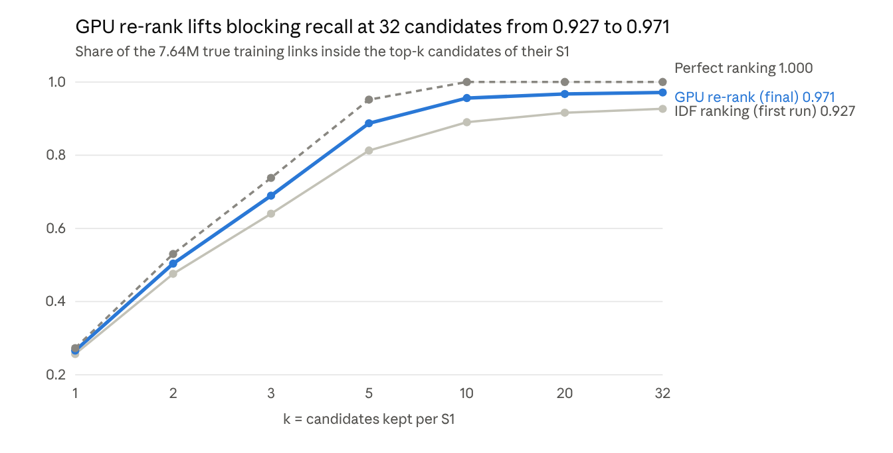
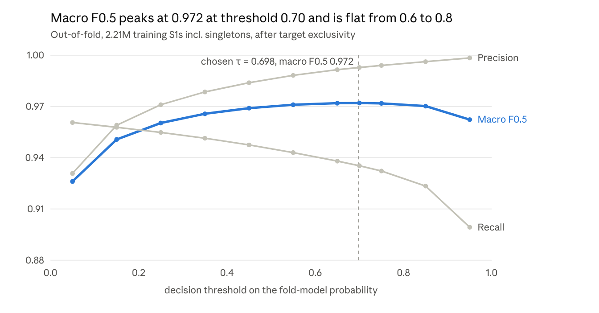
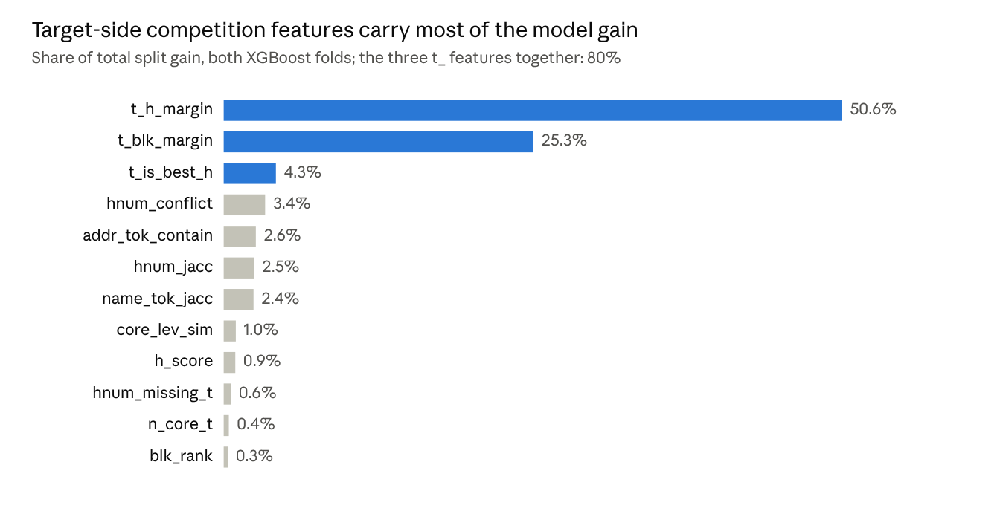
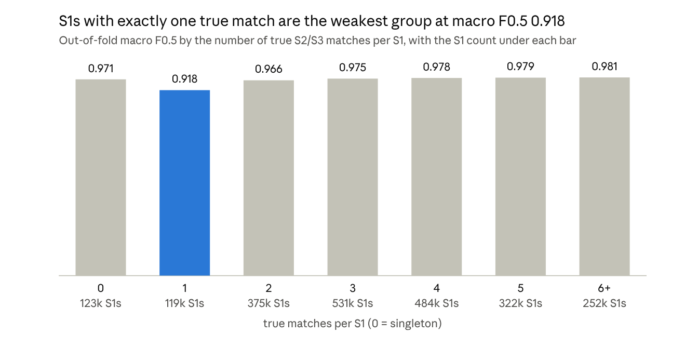
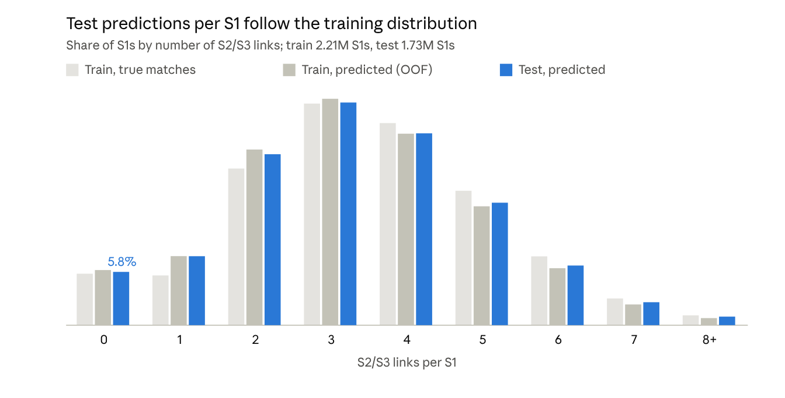

# Entity Resolution Pipeline Results (baseline)

2026-10-04 · Fahim Ahamed · live, editable version: [Claude Doc](https://claude.ai/code/artifact/e64d7526-3b76-4901-8321-07c87d2aa7ce)

The baseline pipeline ran end to end on the full challenge data. Out-of-fold macro F0.5 on the training set is 0.972, blocking recall is 0.971, and both submission files passed the format check.

Sources: `artifacts/*.json` and `work/**/_MANIFEST.json` from the run, `work/logs/pipeline_main.log`, and one read-only pass over the out-of-fold predictions. Code: `code/business_entity_resolution/` on branch `training-pipeline`.

## Headline metrics

All training-side numbers are out-of-fold: each S1 is scored by a model that never saw it, and singletons count in every average. The test split was never used for tuning.

| Metric | Value |
| --- | --- |
| Macro F0.5, all 2,206,821 training S1s | **0.9720** |
| Macro F0.5, singletons (123,247 S1s) | 0.9711 |
| Macro F0.5, S1s with matches | 0.9721 |
| Decision threshold τ | 0.6975 |
| Micro precision / recall | 0.9927 / 0.9354 |
| Predicted links / true links (train) | 7,197,110 / 7,638,365 |
| False positives / false negatives | 52,190 / 493,445 |
| Blocking recall (K = 32) | 0.9713 (7,419,426 of 7,638,365 links) |
| Candidate pairs, train / test | 69.15M / 54.72M |
| Test links written | 5,730,818 for 1,732,544 S1s (5.78% empty) |
| Format check | PASS (local checker; the official validator is not in the repo) |
| End-to-end wall time | about 3 hours on an RTX 5060 Laptop GPU, 16 GB RAM |

## Pipeline stages

One command, `python run_pipeline.py`, runs 16 stage processes in order: train stages 00–10, then test stages 01, 03, 04, 05 and 11. Stage 04 is the slowest on both sides, and stage 07 has the highest RAM peak.

| Stage | What it does | Device | Train time | Test time | Peak RSS | Peak VRAM |
| --- | --- | --- | --- | --- | --- | --- |
| 01 normalize | Indic→Latin transliteration, accents, case, placeholders, record flags | CPU | ~10 min | 3 min | 1.4 GB | 0 |
| 02 labels + rewrite map | Ground-truth arrays, entity-level folds, learned Indic token rewrites (train only) | CPU | 0.6 min | — | <1 GB | 0 |
| 03 records + index | Canonical names and addresses, 265-byte records, 6-family inverted index | CPU | 14 min | 13 min | 3.2 GB¹ | 0 |
| 04 candidates | Key lookup, IDF aggregation, GPU re-rank, top 32 per S1 | CPU + GPU | 40 min | 28 min | 2.1 GB | 1.9 GB |
| 05 features | 64 pair features (sets, trigrams, Levenshtein) plus competition features | GPU | 12 min | 27 min² | 4.9 GB¹ | 0.5 GB |
| 06 training set | All positives, hard negatives, 2% hashed easy negatives | CPU | 2 min | — | 1.4 GB | 0 |
| 07 train | XGBoost, 2 entity-level folds | GPU | 14 min | — | 5.9 GB | 3.2 GB |
| 08–10 OOF, threshold, bundle | Out-of-fold scores, exclusivity, exact τ sweep | GPU + CPU | 4 min | — | 1.0 GB | 0.3 GB |
| 11 predict | Fold-average scores, exclusivity, τ, write TSVs, format check | GPU + CPU | — | 24 min | 1.7 GB | 0.3 GB |

¹ Includes pages of memory-mapped record files, which the OS can evict.
² Slowed by sharing the GPU with the neural experiment; the train side ran at 165k pairs/s versus 67k on test.

Stage 07 used 5.9 GB of RAM, far above the 0.5 GB estimated before the run. XGBoost builds its training matrix in host memory from numpy batches and keeps it next to the GPU copy, because cupy is not installed. Available RAM dipped to 1.7 GB during that stage.

## Blocking

Blocking keeps 7,419,426 of the 7,638,365 true training links (recall 0.9713) in a pool of 69.15M candidate pairs, 31.3 per S1. The first run ranked candidates by summed key IDF and reached only 0.927. Re-ranking every aggregated candidate on the GPU before the top-32 cut closed most of that gap.

*Source: artifacts/blocking_report_train.json (both runs) and n_true from the training ground truth · 2,206,821 S1s*

The re-rank score is 0.4 × best core-name similarity (token Jaccard or trigram Dice) + 0.4 × address-token Jaccard + 0.2 × house-number Jaccard + 0.02 × IDF score normalised by the target's key mass. Compact records stay on the GPU (1.5 GB), and the re-rank scores about 8M pairs/s. The 218,939 links still missed (2.9%) were not split by cause on the final settings. On a 20k-S1 sample before the cap change, 2.4% of links shared no kept key and about 1% ranked below 32. Only 120 S1s got no candidates.

Every key is hashed with its country, so blocking is a country-equality test that works unchanged for France. Keys seen in more than 1,000 target records are dropped.

| Key family | Keys kept | Postings kept | Keys dropped by cap | Found links sharing this family |
| --- | --- | --- | --- | --- |
| P · core-token pair | 5,503,782 | 23.8M | 772 | 76.9% |
| X · core token × house number | 9,757,745 | 31.0M | 971 | 74.0% |
| C · concatenated core name | 5,256,865 | 10.3M | 15 | 62.9% |
| A · identifying address word | 562,235 | 30.4M | 4,098 | 57.3% |
| S · street key | 2,844,054 | 7.5M | 77 | 53.2% |
| N · core-name token | 1,505,311 | 26.6M | 2,507 | 45.4% |

## Model and threshold

The pair classifier is GPU XGBoost trained on 32.87M sampled rows: all 7.42M blocked positives, 24.71M hard negatives and 0.74M hashed easy negatives weighted ×50. Two folds split by S1 entity; each model trains on one fold (15.6M rows) and scores the other, so every training candidate gets an out-of-fold probability.

| Setting | Value |
| --- | --- |
| Booster | `hist` on CUDA, `max_bin` 256, `max_depth` 8, learning rate 0.08 |
| Sampling | `subsample` 0.8, `colsample_bytree` 0.8, `min_child_weight` 5, `lambda` 1 |
| Rounds | 1,500 in both folds; validation log-loss still falling slightly (0.0116 / 0.0119) |
| Data feed | Streaming `DataIter` into a `QuantileDMatrix`, 500k-row batches |
| Time per fold | about 7 min (2.8 min matrix build, 4 min boosting) |
| Test scoring | Mean of the two fold models |

The threshold is chosen by an exact sweep of macro F0.5 over every distinct OOF probability, after each target is given to its highest-scoring S1 only. Links that blocking never proposed still count as misses.

*Source: artifacts/threshold.json sweep grid (exact sweep in threshold_sweep_full.npz) · train OOF*

Lowering τ to 0.5 would add 125k links but cost 0.002 of macro F0.5, because each false merge costs more than a miss under F0.5.

*Source: total_gain from work/models/fold0.ubj and fold1.ubj, top 12 of 64 features*

The model leans on how a pair compares with the target's other S1 suitors (`t_h_margin`, `t_blk_margin`, `t_is_best_h`). That matches the data: half of all S1s share their core name with another S1, so the address decides which twin owns a record. These features use only feature values, never labels, and are computed the same way on test.

## Error analysis

79.4% of training S1s are scored perfectly, and the remaining loss is mostly missed links rather than false merges: 493,445 misses against 52,190 false positives. All figures are out-of-fold at τ = 0.6975.

| Where a true link was lost | Links | Share of misses |
| --- | --- | --- |
| Never proposed by blocking | 218,939 | 44% |
| Scored below τ | 204,158 | 41% |
| Lost to exclusivity (target given to another S1) | 70,348 | 14% |

| What a false positive matched | Links | Share of FPs |
| --- | --- | --- |
| A distractor record that belongs to no S1 | 42,828 | 82% |
| A record that belongs to a different S1 | 9,362 | 18% |
| … of all FPs, those on a singleton S1 | 3,836 | 7% |

*Source: train OOF decision candidates at τ = 0.6975 joined with train_ground_truth.tsv · 2,206,821 S1s*

One-match S1s lose the most because a single miss zeroes their score. The model predicts the exact number of matches for 79.8% of S1s, too few for 18.3% and too many for 1.9%, which is the trade F0.5 asks for.

| Country | S1s | Macro F0.5 | Singleton F0.5 | Precision | Recall |
| --- | --- | --- | --- | --- | --- |
| US | 1,323,633 | 0.9741 | 0.9754 | 0.9942 | 0.9383 |
| India | 883,188 | 0.9689 | 0.9647 | 0.9906 | 0.9310 |

India trails the US by 0.005, mostly on singletons and recall. Indic-script names and reordered addresses are the likely cause, though that split was not measured. Precision is similar for S2 (0.9929) and S3 (0.9926) targets.

## Test predictions

The test run wrote 5,730,818 links for 1,732,544 S1s: 3.31 links per S1, with 5.78% left empty. Training S1s average 3.46 true matches and 5.6% are singletons, so the test output has the expected shape, France included. No test labels exist, so test accuracy is unknown until the leaderboard scores it.

*Source: output/matching_results.tsv and train OOF at τ = 0.6975 · counts of 8 or more links pooled*

| Country | S1s | Links | Links per S1 | Empty S1s |
| --- | --- | --- | --- | --- |
| India | 809,986 | 2,657,289 | 3.28 | 5.87% |
| US | 663,106 | 2,192,540 | 3.31 | 5.85% |
| France (unseen in training) | 259,452 | 880,989 | 3.40 | 5.34% |

France gets slightly more links and fewer empty lists than the two training countries. That could be correct, or a sign of looser matching on French names and addresses, which no training data covers. Links split evenly between sources: 2,784,016 from S2 and 2,946,802 from S3. Test blocking produced 54.72M candidate pairs, 31.6 per S1, and only 38 S1s got none.

## Problems found and fixed during the run

Five issues surfaced on the real data. All are fixed, committed and pushed to the `training-pipeline` branch.

| Problem | Effect | Fix | Commit |
| --- | --- | --- | --- |
| Candidates ranked only by summed key IDF | Blocking recall 0.927, below the 0.95 gate | GPU re-rank of every aggregated candidate; N/A key cap raised from 300 to 1000 | e18caf6 |
| Stages resumed from stale outputs | A rerun reused old candidate shards and reported the old recall | Each stage stores an input signature and clears outputs built from other inputs | 628cc85 |
| Stage 03 rename failed on Windows | `WinError 32` on `tgt.npy`, found by the neural thread | Release every memmap reference before the rename | 61d5e3a |
| Runner crashed on Hindi text | The run stopped at test stage 01 under the Windows code page | Console output forced to UTF-8 | 459a27b |
| Runner output was buffered and the summary missing from the log | The log looked stalled and never showed completion | Line-by-line flush; stage times and `PIPELINE COMPLETE` written to the log | 02eefd1, b9ae814 |

xgboost 3.4.1 (CUDA build) was also installed with your approval and verified on the GPU (beb7a97). A local format checker now runs at the end of stage 11, because the official validator is not in the repo (5b884df).

## Limitations and next steps

- **France is untested.** It has no training data, no state table, and legal forms (SARL, SAS) are not canonicalised. Its slightly higher link rate needs a look before the final submission.
- **Blocking caps recall at 0.971.** 218,939 links never reach the model, 44% of all misses. A larger K or a retrieval channel (the neural thread's bi-encoder) could recover some.
- **Below-threshold misses are 41% of the loss.** A per-S1 relative threshold or a second-stage model on OOF competition features may recover some without adding false merges.
- **Boosting had not converged.** Both folds used all 1,500 rounds with validation log-loss still falling; more rounds or a higher learning rate may help slightly.
- **Stage 07 needs about 6 GB of RAM.** If memory is tighter, use `--entity-frac` in stage 06 or a lower `MAX_GPU_MEMORY_GB`.
- **τ was tuned on single-model scores** but test uses the mean of two models, which compresses scores a little.
- **Still missing for the package:** run the official `utils/validate_submission.py`, and fill `Documentation_template.md`. Neither file is in this repo.

Code and the pipeline docs live in `code/business_entity_resolution/` on the `training-pipeline` branch; the full run log, kept out of git, is `work/logs/pipeline_main.log`.
